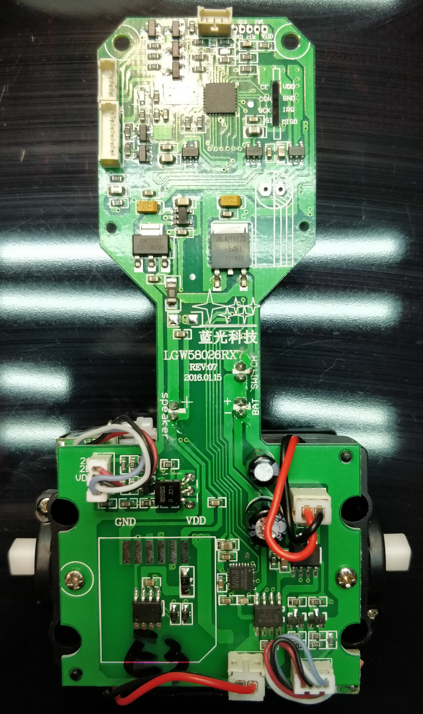

# wltoys f4 robot wifi control protocol
Proof of concept Android app

Communication through UDP port 40000, destination IP: 192.168.0.1

**start frame** ? - starts the video stream - app sents it every 1sec
    
        0x63  0x63  0x01  0x00  0x00  0x00  0x00
                    0x02 camera mode?

   

 **control frame** every 5ms

    0x63  0x63  0x0a  0x00  0x00  0x08  0x00  0x66  0x80  0x80  0x80  0x80  0x00  0x00  0x99
    H     H     C     C     C     C     C     C           FR          LR    MODE  CRC   C

 - C - constant, unknown
 - FR - forward/reverse - min 0x01, mid 0x80, max 0xFF
 - LR - left/right - min 0x01, mid 0x80, max 0xFF
 - MODE -  in normal operation 0x00. Send as one frame with specified
   mode.
	 - 0x01 - red
	 - 0x02 - pink
	 - 0x04 - green
	 - 0x08 - blue

CRC - XOR of 5 bytes before CRC. seems to be working fine

More pictures in teardown folder

